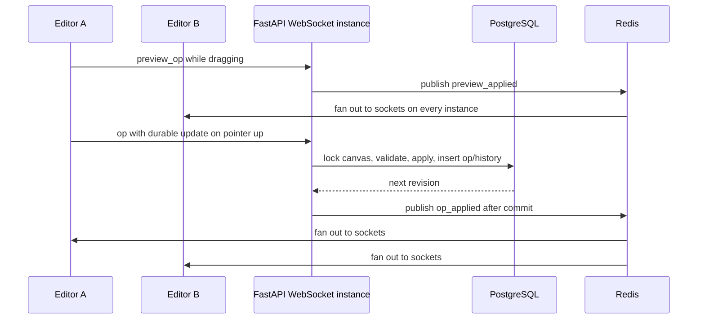

# Architecture

## Logical Components

```mermaid
flowchart TB
  subgraph Client["client/src"]
    App["App.tsx"]
    API["api.ts"]
    Dashboard["Dashboard/Auth"]
    Whiteboard["Whiteboard.tsx"]
    Socket["useCanvasSocket"]
    Interactions["useWhiteboardInteractions"]
    Renderers["whiteboard renderers"]
  end

  subgraph Server["server/app"]
    Main["main.py"]
    Auth["auth.py + routes_auth.py"]
    CanvasRoutes["routes_canvases.py"]
    WS["ws.py"]
    RedisClient["redis_client.py"]
    Ops["canvas_ops.py"]
    Validation["validation.py"]
    Security["security.py + rate_limit.py"]
  end

  subgraph Coordination["Redis"]
    PubSub["canvas event pub/sub"]
    Presence["presence TTL keys"]
    RateLimit["rate-limit counters"]
  end

  subgraph Database["PostgreSQL"]
    Users["users"]
    Sessions["sessions"]
    Canvases["canvases"]
    Members["canvas_members"]
    OpsTable["canvas_ops"]
    History["canvas_history"]
  end

  App --> Dashboard
  App --> Whiteboard
  Dashboard --> API
  Whiteboard --> API
  Whiteboard --> Socket
  Whiteboard --> Interactions
  Whiteboard --> Renderers
  API --> CanvasRoutes
  API --> Auth
  Socket --> WS
  Main --> Security
  Main --> Auth
  Main --> CanvasRoutes
  Main --> WS
  Auth --> Users
  Auth --> Sessions
  CanvasRoutes --> Canvases
  CanvasRoutes --> Members
  WS --> Ops
  WS --> Validation
  WS --> Canvases
  WS --> OpsTable
  WS --> History
  WS --> PubSub
  WS --> Presence
  Security --> RateLimit
  Main --> RedisClient
```

## Dependency Direction

- Frontend components depend on hooks and lib helpers.
- Hooks depend on pure operation/geometry helpers and typed contracts.
- Backend routes depend on auth, DB pool, helpers, and validation.
- WebSocket persistence depends on `canvas_ops.py` for operation application and inversion.
- Database schema is initialized by `server/app/db.py` during FastAPI startup.

## Backend Startup

1. `main.py` creates a FastAPI app with lifespan.
2. Lifespan calls `init_db()`.
3. `init_db()` reads `server/schema.sql` and executes it.
4. The WebSocket room manager starts a Redis Pub/Sub listener when `REDIS_URL` is configured.
5. Middlewares are registered:
   - `SameOriginMiddleware`
   - `RateLimitMiddleware`
6. Routers are included:
   - auth routes
   - canvas routes
7. WebSocket route is registered at `/ws/canvases/{canvas_id}`.

## Frontend Startup

1. `main.tsx` renders `App`.
2. `App` starts in loading mode.
3. `App` calls `api.getMe()`.
4. Valid cookie moves user to dashboard.
5. Missing/invalid cookie moves user to auth.
6. Dashboard opens whiteboard by setting local screen state; there is no router library.

## Realtime Architecture

Previews are best-effort and not durable. Durable operations are serialized by `SELECT ... FOR UPDATE` on the canvas row. Multi-shape user actions are wrapped in `batch` operations so the database revision, audit log, and shared undo/redo history still treat the action as one coherent edit.

## Multi-Server Coordination

Each backend instance keeps only its local WebSocket objects in memory. Redis coordinates cross-instance behavior:

- Canvas event Pub/Sub fans out `op_applied`, `preview_applied`, cursor, presence, rename, access-removal, and canvas-deletion events.
- Presence uses per-canvas Redis connection sets and per-connection TTL records.
- HTTP and WebSocket rate limits use Redis counters when `REDIS_URL` is set.
- Access removal and canvas deletion publish fast close notifications, while PostgreSQL membership/session checks remain authoritative.

If Redis is not configured, the backend falls back to local-only fanout, local-only presence, and in-memory rate limits for single-process development.
