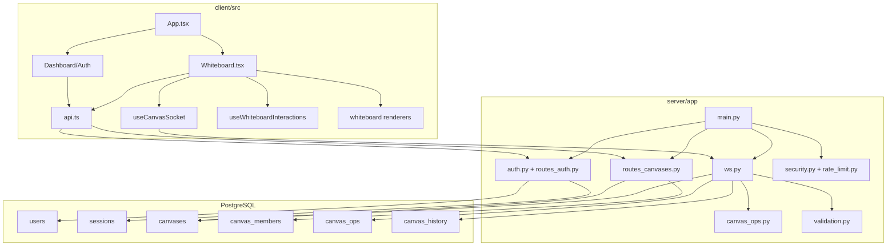
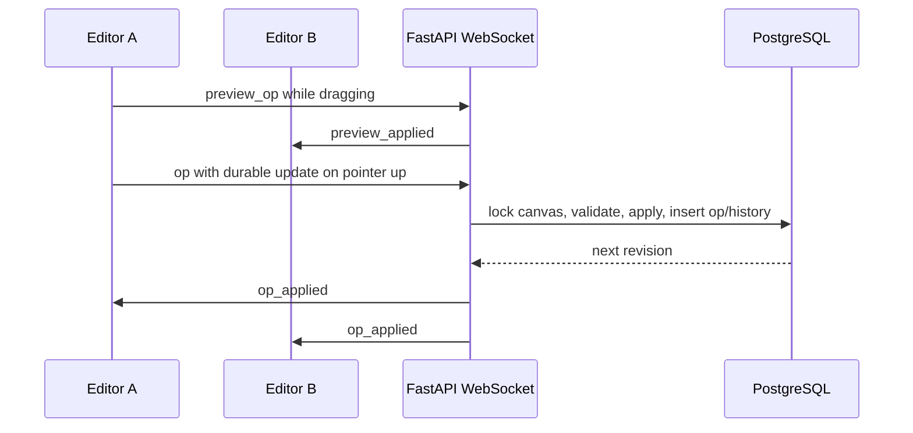

# Architecture

## Logical Components

## Dependency Direction

- Frontend components depend on hooks and lib helpers.
- Hooks depend on pure operation/geometry helpers and typed contracts.
- Backend routes depend on auth, DB pool, helpers, and validation.
- WebSocket persistence depends on `canvas_ops.py` for operation application and inversion.
- Database schema is initialized by `server/app/db.py` during FastAPI startup.

## Backend Startup

1. `main.py` creates a FastAPI app with lifespan.
2. Lifespan calls `init_db()`.
3. `init_db()` reads `server/schema.sql` and executes it.
4. Middlewares are registered:
   - `SameOriginMiddleware`
   - `RateLimitMiddleware`
5. Routers are included:
   - auth routes
   - canvas routes
6. WebSocket route is registered at `/ws/canvases/{canvas_id}`.

## Frontend Startup

1. `main.tsx` renders `App`.
2. `App` starts in loading mode.
3. `App` calls `api.getMe()`.
4. Valid cookie moves user to dashboard.
5. Missing/invalid cookie moves user to auth.
6. Dashboard opens whiteboard by setting local screen state; there is no router library.

## Realtime Architecture

Previews are best-effort and not durable. Durable operations are serialized by `SELECT ... FOR UPDATE` on the canvas row. Multi-shape user actions are wrapped in `batch` operations so the database revision, audit log, and shared undo/redo history still treat the action as one coherent edit.

## Single-Server Assumption

Active rooms, active users, rate-limit buckets, and WebSocket fanout are in process memory. This is intentional for the current phase. Running multiple backend instances would require external coordination, likely Redis or Postgres listen/notify for fanout and shared rate limit state.
