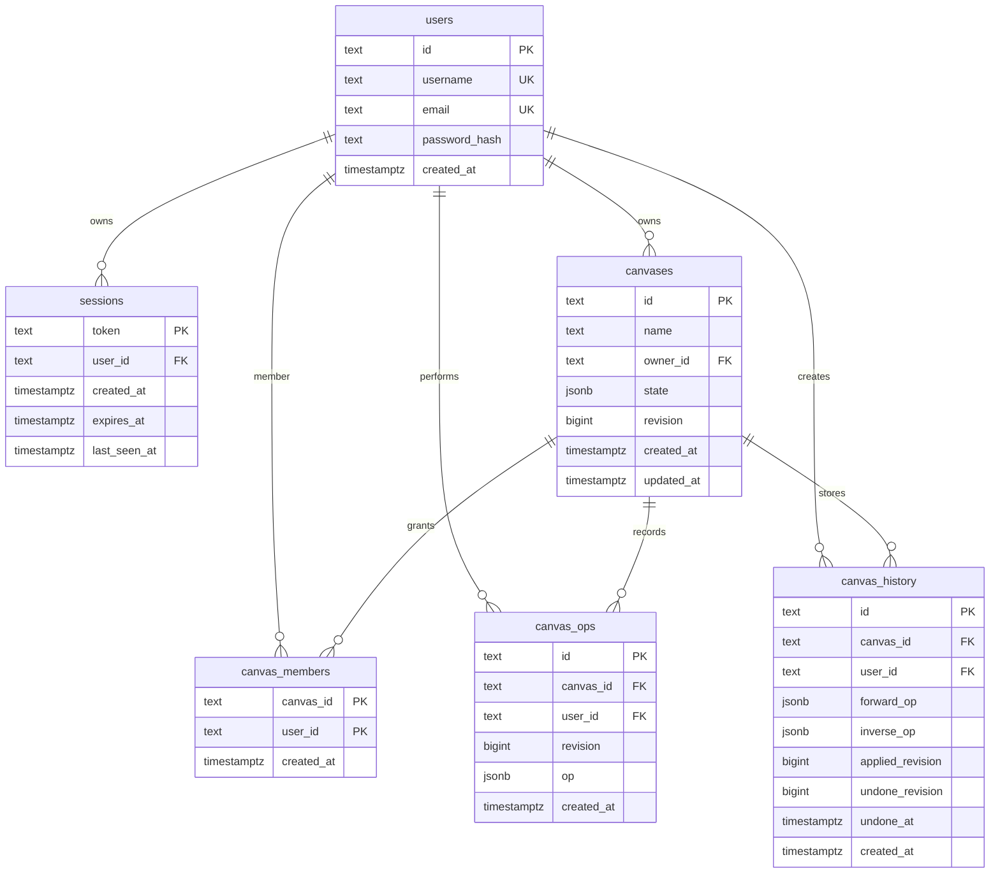

# Database

PostgreSQL is the durable source of truth. Schema lives in `server/schema.sql` and is executed on FastAPI startup.

## Entity Relationship Diagram



## Tables

### `users`

Stores account identity and password hash.

| Field | Format |
|---|---|
| `id` | UUID string generated by backend |
| `username` | normalized lowercase string, unique |
| `email` | normalized lowercase string, unique |
| `password_hash` | `pbkdf2_sha256$260000$salt_hex$digest_hex` |
| `created_at` | database timestamp |

### `sessions`

Stores active login sessions.

| Field | Format |
|---|---|
| `token` | random URL-safe string, sent only as httpOnly cookie |
| `user_id` | FK to `users.id` |
| `created_at` | database timestamp |
| `expires_at` | creation time + 12 hours |
| `last_seen_at` | updated on valid token lookup |

Expired sessions are deleted opportunistically during session creation and token lookup.

### `canvases`

Stores durable canvas metadata and the current canvas state.

| Field | Format |
|---|---|
| `id` | UUID string |
| `name` | validated non-empty string |
| `owner_id` | FK to `users.id` |
| `state` | JSONB object with top-level `shapes` array and optional `backgroundColor` |
| `revision` | monotonically increasing persisted revision |
| `created_at` | database timestamp |
| `updated_at` | updated on durable operation or rename |

Deleting a canvas removes dependent `canvas_members`, `canvas_ops`, and `canvas_history` rows through foreign-key cascades.

Current state example:

```json
{
  "backgroundColor": "#eff5f5",
  "shapes": [
    {
      "id": "shape-id",
      "type": "rect",
      "groupId": "optional-group-id",
      "x": 100,
      "y": 120,
      "width": 240,
      "height": 120,
      "strokeColor": "#1d3557",
      "fillColor": "#a8dadc",
      "strokeOpacity": 1,
      "fillOpacity": 0.6,
      "strokeWidth": 2,
      "createdBy": "user-id",
      "updatedAt": 1783190000000
    }
  ]
}
```

`groupId` is optional. When present, every shape with the same `groupId` belongs to one locked frontend group. Clearing a group stores an `update_shape` patch with `"groupId": null`; operation application removes the field from the shape.

Text shapes add:

```json
{
  "text": "Label",
  "textColor": "#1d3557",
  "textOpacity": 1,
  "fontSize": 20
}
```

### `canvas_members`

Join table defining who can open a canvas. Owner is also a member. Only owner can mutate this table through the API.

### `canvas_ops`

Append-only log of every persisted canvas operation, including undo and redo operations. This is an audit trail and idempotency check source.

| Field | Meaning |
|---|---|
| `id` | operation id generated client-side for normal operations, server-side for undo/redo |
| `canvas_id` | canvas |
| `user_id` | actor |
| `revision` | resulting canvas revision |
| `op` | operation JSON |
| `created_at` | database timestamp |

### `canvas_history`

Shared undo/redo stack.

| Field | Meaning |
|---|---|
| `forward_op` | operation that originally changed state |
| `inverse_op` | backend-derived operation to undo it |
| `applied_revision` | latest revision where forward op is considered active |
| `undone_revision` | revision where the row was most recently undone; used for deterministic redo order |
| `undone_at` | null means active undo candidate; non-null means redo candidate |

New durable edits delete redo rows for that canvas.

## Revision Rules

Revision increments for:

- durable create/update/delete/reorder/batch operation
- undo
- redo

Revision does not increment for:

- cursor movement
- presence joins/leaves
- preview operations during drag/resize
- member changes
