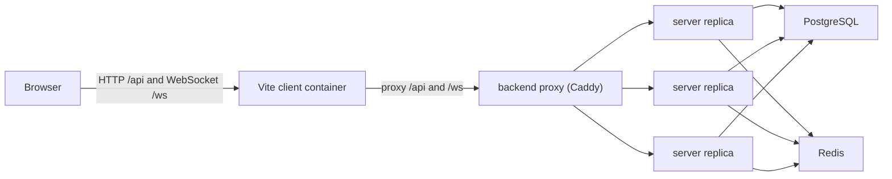

# Multi-Server Support

LiveBoard supports running multiple FastAPI backend containers behind a backend proxy. PostgreSQL remains the source of truth for durable application state, and Redis coordinates the ephemeral state that cannot safely live inside one backend process when more than one backend is running.

## Goals

- Allow `server` containers to scale horizontally for HTTP and WebSocket traffic.
- Keep canvas operation ordering, undo/redo, sessions, and memberships authoritative in PostgreSQL.
- Avoid sticky WebSocket sessions as a correctness requirement.
- Keep local Docker Compose development close to the scaled runtime path.
- Preserve a single-process fallback for direct backend development when `REDIS_URL` is unset.

## Runtime Shape



In Docker Compose, `server` containers expose port `3001` only inside the Compose network. The `backend` Caddy service publishes host port `3001` and forwards HTTP and WebSocket traffic to the `server` service. The frontend container proxies browser `/api` and `/ws` requests to `backend:3001`.

Run the scaled local stack with:

```bash
docker compose up --build --scale server=3
```

## Durable State Ownership

PostgreSQL owns:

- users
- sessions
- canvas memberships
- canvas metadata
- durable canvas state in `canvases.state`
- monotonically increasing canvas revisions
- operation log rows in `canvas_ops`
- shared undo/redo rows in `canvas_history`

Durable canvas operations, undo, and redo still lock the canvas row with `SELECT ... FOR UPDATE`. This keeps operation ordering correct even when different WebSocket messages land on different backend replicas.

Redis owns only ephemeral coordination state:

- WebSocket fanout across backend replicas
- active presence connection records
- fast access-removal and canvas-deletion socket invalidation
- shared rate-limit counters

Redis is not used as an authoritative cache for canvas state.

## WebSocket Fanout

Each backend process keeps only its local WebSocket objects in memory. When an event must reach every connected editor on a canvas, the receiving backend:

1. Sends the event to matching sockets connected to the current process.
2. Publishes the event to Redis on `liveboard:canvas:{canvas_id}:events`.
3. Other backend replicas receive the Redis Pub/Sub event and forward it to their local sockets.

Published events include:

- `op_applied`
- `preview_applied`
- `cursor`
- `presence_join`
- `presence_leave`
- `canvas_renamed`
- cluster control events for access removal and canvas deletion

Every published envelope includes the origin server id. The origin server ignores its own Redis echo because it has already sent to its local sockets.

## Durable Message Recovery

Redis Pub/Sub is intentionally treated as best-effort transport. This is acceptable for cursor, preview, and presence messages because those are transient. Durable operation messages are safer because PostgreSQL commits first and every `op_applied` carries a revision.

The frontend tracks the current canvas revision. If it receives an `op_applied` message with a revision greater than the next expected revision, it treats that as a missed durable event and refreshes through:

```text
GET /api/canvases/{canvas_id}
```

That response includes the latest canvas state and history status, so the client can replace local state with the authoritative PostgreSQL snapshot.

## Presence

Presence uses Redis connection records instead of process-local room membership alone.

Keys:

```text
liveboard:presence:{canvas_id}:connections
liveboard:presence:conn:{connection_id}
```

The per-canvas set stores connection ids. Each per-connection record stores user JSON and has a short TTL. Active sockets refresh their presence TTL while sending messages. Disconnect removes the connection id and record.

Join and leave broadcasts are user-level transitions:

- A join is sent only when a user moves from zero active connections on a canvas to at least one.
- A leave is delayed briefly and sent only if the user still has no active connections. This avoids flicker during quick reconnects or multiple-tab churn.

Snapshot `users` are derived from Redis presence when Redis is configured. In single-process fallback mode, they are derived from local sockets.

## Access Removal And Canvas Deletion

Access removal and canvas deletion publish cluster control messages so every backend replica can close affected local sockets quickly.

These Redis messages are a fast invalidation path, not the security boundary. Open sockets still re-check session validity and canvas membership:

- before every incoming WebSocket message
- every 30 seconds while idle

If a Redis invalidation message is missed, the next database-backed check still closes an unauthorized socket.

## Shared Rate Limits

When `REDIS_URL` is configured, HTTP and WebSocket rate limits use Redis counters so limits are shared across backend replicas.

Current limits:

- login/signup: `10/min` per client IP
- authenticated HTTP API routes: `120/min` per user/method/path
- unauthenticated HTTP API routes: `120/min` per client/method/path
- WebSocket cursor: `1500/min` per user/canvas
- WebSocket preview: `1500/min` per user/canvas
- WebSocket undo/redo: `300/min` per user/canvas
- WebSocket writes: `90/min` per user/canvas

Counters use a fixed window and an atomic Redis script that increments the current bucket and sets expiry on first write. If `REDIS_URL` is unset, the same limits run in process memory for single-backend development.

## Why This Approach

The main design choice is to keep PostgreSQL authoritative and use Redis only for coordination.

This was chosen because:

- The existing canvas operation path already serializes durable edits with PostgreSQL row locks.
- Undo/redo correctness depends on the PostgreSQL `canvas_history` table.
- Caching canvas state in Redis would add invalidation complexity without removing the need for PostgreSQL commits.
- WebSocket fanout, presence, and rate limits are ephemeral and naturally fit Redis.
- Pub/Sub plus revision-gap recovery gives good realtime behavior without requiring durable Redis Streams for every event.

## Alternatives Considered

### Sticky Sessions Only

Sticky sessions would keep each browser attached to the same backend instance, reducing fanout complexity. This was rejected as the primary scaling strategy because users on different replicas still need to see each other’s updates, and losing stickiness would become a correctness risk.

### PostgreSQL LISTEN/NOTIFY

PostgreSQL could fan out events through `LISTEN/NOTIFY`. This would reduce infrastructure, but it mixes high-frequency cursor/preview traffic into the durable database layer and is a less natural fit for transient presence and rate-limit counters.

### Redis Streams For All Events

Redis Streams would make fanout more durable than Pub/Sub. That extra durability is useful for some systems, but LiveBoard already has durable state in PostgreSQL and client revision-gap recovery. Streams would add consumer-group bookkeeping and replay semantics that are unnecessary for cursor, preview, and presence traffic.

### Redis As Canvas State Cache

Caching `canvases.state` in Redis could reduce database reads, but it would create cache invalidation and recovery paths around the most important state in the system. The current scale goal is backend parallelism, not read-heavy canvas browsing, so the cache was deliberately avoided.

## Tradeoffs

- Redis Pub/Sub can drop messages during Redis or subscriber interruptions. Durable revision-gap recovery mitigates this for persisted operations; transient cursor/preview/presence messages may be missed.
- Presence is eventually consistent and TTL-based. A crashed backend may leave presence records visible until their TTL expires.
- HTTP rate limiting performs a session lookup for authenticated requests so limits can be keyed by user id. This is correct but adds database work.
- The current `CanvasRoomManager` owns local rooms, cluster fanout, and presence coordination. It works, but it is a good candidate for future module extraction.
- The local Compose proxy is Caddy. Production deployments can use a different load balancer as long as it supports WebSocket proxying and all backend replicas share the same PostgreSQL and Redis deployments.

## Operational Requirements

Multi-server mode requires:

- all backend replicas use the same `DATABASE_URL`
- all backend replicas use the same `REDIS_URL`
- the load balancer supports WebSocket upgrades
- `ALLOWED_ORIGINS` includes the browser-facing frontend origin
- `SESSION_COOKIE_SECURE=true` when deployed behind HTTPS

Health check:

```bash
curl http://localhost:3001/health
```

Expected Redis-enabled response:

```json
{"ok": true, "postgres": true, "redis": true}
```

## Single-Process Fallback

When `REDIS_URL` is unset, the backend still runs for direct local development:

- WebSocket fanout is local-process only.
- Presence is local-process only.
- Rate limits use in-memory counters.

This mode is useful for simple backend development but should not be used with multiple backend processes.
