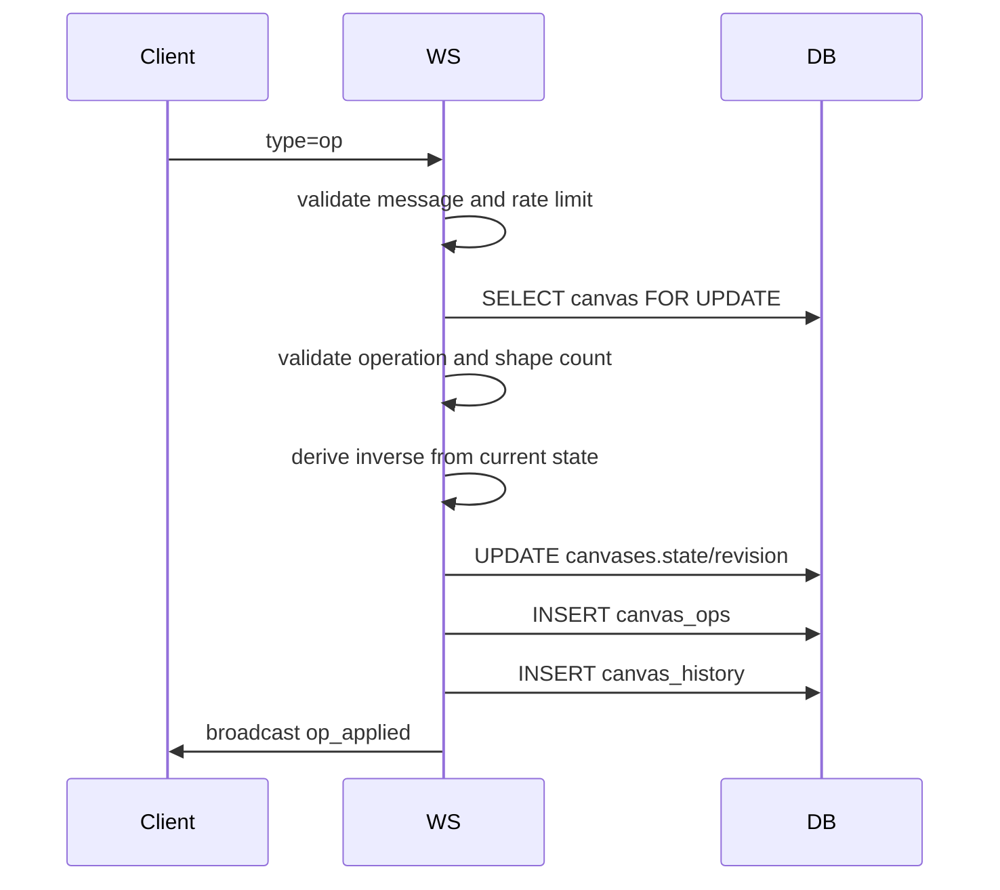

# Realtime Collaboration

Realtime collaboration is implemented in `server/app/ws.py` and `client/src/hooks/useCanvasSocket.ts`.

## Connection

Frontend opens:

```text
/ws/canvases/{canvas_id}
```

No token is in the URL. Browser sends the `liveboard_session` httpOnly cookie as part of the WebSocket handshake.

Backend accepts only when:

- session exists and is not expired
- user is a member of the canvas
- canvas exists

On accept, backend sends:

```json
{
  "type": "snapshot",
  "canvasId": "canvas-id",
  "revision": 12,
  "state": { "shapes": [] },
  "users": [],
  "history": { "canUndo": true, "canRedo": false }
}
```

## Room Manager

`CanvasRoomManager` holds in-memory state:

- `rooms: canvas_id -> set[WebSocket]`
- `users: WebSocket -> user dict`

It handles:

- accept socket
- presence join broadcast
- disconnect cleanup
- presence leave broadcast
- generic broadcast
- forced access removal
- active user list

This is intentionally single-server.

## Message Types

### Client -> Server

```json
{ "type": "cursor", "x": 120, "y": 200, "selectedShapeId": "shape-id" }
```

```json
{ "type": "preview_op", "op": { "id": "...", "kind": "update_shape", "shapeId": "...", "patch": {} } }
```

```json
{ "type": "op", "op": { "id": "...", "kind": "create_shape", "shape": {} }, "history": { "inverse": {} } }
```

The backend no longer trusts the client-provided inverse, but the presence of `history.inverse` marks the operation as undoable. The server derives the true inverse from locked canvas state.

```json
{ "type": "undo" }
```

```json
{ "type": "redo" }
```

### Server -> Client

```json
{ "type": "op_applied", "canvasId": "...", "revision": 13, "userId": "...", "op": {}, "history": {} }
```

```json
{ "type": "preview_applied", "canvasId": "...", "userId": "...", "op": {} }
```

```json
{ "type": "cursor", "user": { "id": "...", "username": "alice" }, "x": 10, "y": 20, "selectedShapeId": null }
```

```json
{ "type": "presence_join", "user": { "id": "...", "username": "alice", "email": "alice@example.com" } }
```

```json
{ "type": "presence_leave", "userId": "..." }
```

```json
{ "type": "access_removed", "message": "Your access to this canvas has been removed." }
```

```json
{ "type": "session_expired", "message": "Your session has expired. Please sign in again." }
```

```json
{ "type": "history_status", "history": { "canUndo": false, "canRedo": true } }
```

## Durable Operation Flow



## Undo Flow

1. Server locks canvas row.
2. Selects latest `canvas_history` row where `undone_at IS NULL`.
3. Applies `inverse_op`.
4. Inserts applied inverse into `canvas_ops`.
5. Sets `undone_at = NOW()`.
6. Broadcasts `op_applied`.

## Redo Flow

1. Server locks canvas row.
2. Selects latest `canvas_history` row where `undone_at IS NOT NULL`.
3. Applies `forward_op` with a new operation id.
4. Inserts redo op into `canvas_ops`.
5. Sets `undone_at = NULL` and updates `applied_revision`.
6. Broadcasts `op_applied`.

## Session And Membership Rechecks

Open sockets re-check:

- before every incoming message
- every 30 seconds while idle

If session is expired/deleted, server sends `session_expired` and closes with code `1008`.

If membership is removed, server sends `access_removed` and closes with code `1008`.
