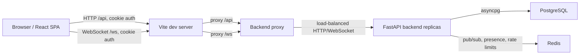

# System Overview

LiveBoard is a real-time collaborative whiteboard for small design-review sessions. The product assumes a small group of authenticated users editing a shared canvas synchronously, with persisted state so the same canvas can be reopened later.

## Core Capabilities

- Account signup, login, logout, and session persistence.
- Dashboard of canvases the current user can access.
- Canvas creation by authenticated users.
- Nested owner-scoped dashboard folders with drag/drop moves and sibling ordering.
- Owner-managed canvas sharing by username or email.
- Owner-managed access removal.
- Realtime collaborative editing over WebSockets.
- Presence list and remote cursors.
- Shape creation for rectangles, ellipses, lines, and text.
- Functionally infinite canvas viewport with wheel zoom, middle-button/background pan, and box selection.
- Shape selection, multi-selection, movement, resize, rotation, deletion, z-ordering, color, opacity, stroke width, text size, and text alignment controls.
- Grouping, nested grouping, group transforms, and locked group-member editing.
- Inline text editing on the canvas.
- Server-backed undo and redo shared across all editors.
- Durable canvas state in PostgreSQL.

## Intentional Scope

LiveBoard focuses on a small-team collaborative drawing surface rather than a full whiteboard suite. It does not implement:

- Character-by-character collaborative text editing.
- Viewer/editor/owner role tiers beyond owner-only access management.
- Share links.
- File/image uploads.
- Per-span or mixed-style rich text editing.
- Export.
- Mobile-first touch workflows.

## Runtime Stack

| Layer | Technology | Role |
|---|---|---|
| Frontend | React 19, TypeScript, Vite, lucide-react | SPA, dashboard, whiteboard UI |
| Backend | FastAPI, Python 3.12, asyncpg | HTTP API, WebSocket API, auth, persistence |
| Database | PostgreSQL 16 | Users, sessions, canvases, memberships, operations, history |
| Coordination | Redis 7 | Cross-server WebSocket fanout, presence, invalidation, rate-limit counters |
| Dev Runtime | Docker Compose | Local db/redis/server/proxy/client services |

## Top-Level Request Flow

In Docker, Vite proxies to `http://backend:3001` and `ws://backend:3001`. The backend proxy forwards requests to one or more `server` containers. From the browser, all calls are same-origin against `localhost:5173`.

## Important Invariants

- The durable canvas state is `canvases.state`.
- `canvases.revision` increments only for persisted operations, undo, and redo.
- Drag and resize previews are transient WebSocket messages and do not increment revision.
- Undo/redo state is server-side in `canvas_history`.
- WebSocket authentication uses the `liveboard_session` httpOnly cookie, not query-string tokens.
- Open WebSockets re-check session validity every 30 seconds and before processing each incoming message.
- Only canvas owners can invite or remove members.
- PostgreSQL is authoritative for durable canvas state; Redis stores only ephemeral coordination state.
- Clients refresh the canvas snapshot if they observe a durable WebSocket revision gap.
